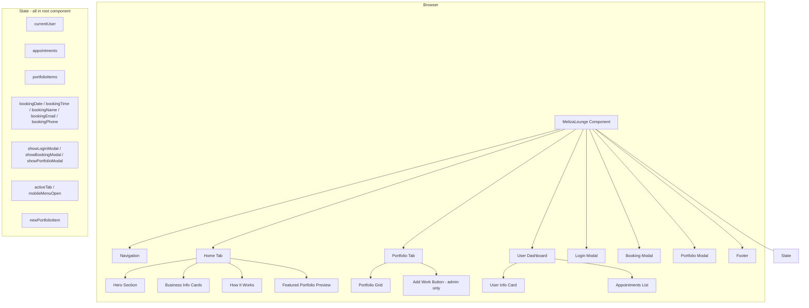

# Architecture — The Meliza Lounge

## Overview

Single-page React application for a nail salon. Handles appointment booking, portfolio display, and basic user identification. Runs entirely client-side — no backend, no database.

## Diagram



## Component Structure

```
MelizaLounge (root, 607 lines)
├── <nav>                  Navigation bar + mobile menu
├── <main>
│   ├── Home tab           Hero, info cards, how-it-works, portfolio preview
│   ├── Portfolio tab      Full grid + add/delete (admin)
│   └── User dashboard     Shown when logged in (any tab)
├── Login modal
├── Booking modal
├── Portfolio modal        Add new item
└── <footer>
```

## Data Flow

```
User action
  → setState (root)
    → re-render affected section
      → (no network calls, no side effects)
```

## Booking Logic

```
getAvailableSlots(date):
  if date is Monday  → []
  if no bookings     → all WORKING_HOURS
  if morning booked  → afternoon slots only
  if afternoon booked→ morning slots only
  if both booked     → []

Validation at submit:
  - All fields required
  - Date ≥ today + 3 days
  - Date is not Monday
  - Selected time still in availableSlots
```

## Coupling Map

| Concern | Coupling | Notes |
|---|---|---|
| Booking ↔ Portfolio | None | Independent state slices |
| Auth ↔ Portfolio | Loose | `currentUser` shows Add/Delete buttons |
| Auth ↔ Dashboard | Loose | `currentUser` shows dashboard section |
| Auth ↔ Booking | None | Anyone can book without login |
| Slots ↔ Appointments | Direct | `getAvailableSlots` reads `appointments` state |

## Known Architectural Gaps (MVP)

| Gap | Impact | Mitigation path |
|---|---|---|
| No persistence | Data lost on refresh | Add Supabase/Firebase |
| No real auth | Anyone can impersonate any email | Add email verification |
| No admin role separation | Any login can delete portfolio | Add role field to user object |
| No email notifications | Confirmation is UI-only | Add SendGrid/Mailgun |
| Monolithic component | Hard to test in isolation | Extract sub-components when adding features |
